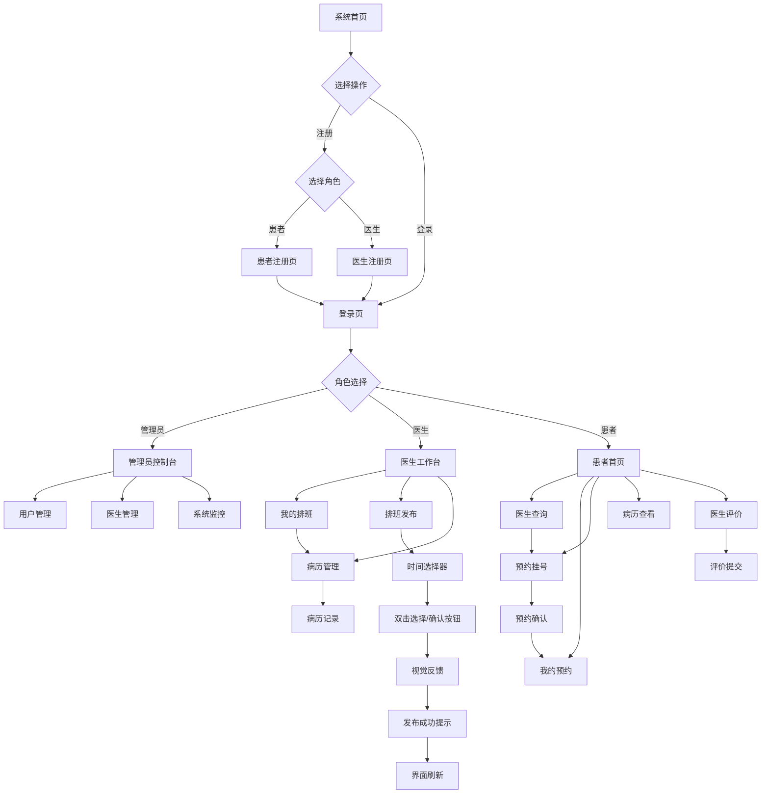

## 1. 产品概述
医院预约系统是一个综合性医疗管理平台，旨在解决患者挂号难、医生排班管理复杂、病历信息分散等问题。系统通过混合技术架构实现高效的预约管理、病历管理和医生评价功能，为医院、医生和患者提供一站式医疗服务解决方案。

目标用户包括医院管理员、医生和患者，通过数字化手段提升医疗服务效率和用户体验。

## 2. 核心功能

### 2.1 用户角色
| 角色 | 注册方式 | 核心权限 |
|------|----------|----------|
| 管理员 | 后台创建账号 | 用户管理、医生管理、系统监控、评价审核 |
| 医生 | 管理员审核注册 | 查看排班、管理病历、查看患者信息 |
| 患者 | 自助注册 | 预约挂号、查看病历、评价医生 |

### 2.2 功能模块
系统主要包含以下核心页面：
1. **患者注册页**：患者账号注册、个人信息填写
2. **医生注册页**：医生账号注册、资质信息提交、等待审核
3. **登录页**：用户身份验证、密码加密、角色选择
4. **管理员控制台**：用户管理、医生管理、系统监控面板
5. **患者预约页**：医生查询、时间选择、预约确认、排班查看、我的预约
6. **医生工作台**：我的排班、排班发布、时间选择、病历管理
7. **病历管理页**：病历编辑、诊断记录、处方开具、历史记录查看
8. **医生评价页**：星级评分、文字评价、匿名提交、评价统计

### 2.3 页面详情
| 页面名称 | 模块名称 | 功能描述 |
|----------|----------|----------|
| 患者注册页 | 信息填写模块 | 手机号验证、密码设置、基本信息录入、身份验证 |
| 患者注册页 | 账号创建模块 | 用户名检查、密码强度验证、注册成功提示、自动登录 |
| 医生注册页 | 资质填写模块 | 医生执业证、科室选择、职称信息、医院信息 |
| 医生注册页 | 审核提交模块 | 资质证书上传、审核状态查看、审核结果通知 |
| 登录页 | 身份验证模块 | 支持用户名密码登录、手机号注册、密码加密存储、角色权限验证 |
| 登录页 | 注册验证模块 | 手机号验证、身份证验证、邮箱验证、验证码发送 |
| 管理员控制台 | 用户管理模块 | 查看用户列表、编辑用户信息、重置用户密码、冻结解冻账号 |
| 管理员控制台 | 医生管理模块 | 医生账号审核、科室分配、排班设置、权限管理 |
| 管理员控制台 | 系统监控模块 | 在线用户统计、预约数据统计、系统性能监控、异常日志查看 |
| 患者预约页 | 医生查询模块 | 按科室筛选、按姓名搜索、医生详情查看、出诊时间显示 |
| 患者预约页 | 预约操作模块 | 时间选择器(开始时间/结束时间标签)、预约时长设置、填写病情描述、确认预约信息、支付挂号费 |
| 患者预约页 | 我的预约模块 | 预约列表查看、预约状态跟踪、预约取消、历史预约记录 |
| 患者预约页 | 排班查看模块 | 查看医生排班表、实时更新预约状态、预约冲突检测 |
| 医生工作台 | 我的排班模块 | 排班列表查看、排班时间显示、排班状态管理 |
| 医生工作台 | 排班发布模块 | 时间选择(支持双击选择)、视觉反馈、排班发布、即时刷新 |
| 医生工作台 | 病历管理模块 | 病历模板选择、症状描述录入、诊断结果记录、处方开具 |
| 病历管理页 | 病历编辑模块 | 病历模板选择、症状描述录入、诊断结果记录、处方开具 |
| 病历管理页 | 病历查看模块 | 历史病历列表、检查报告查看、处方记录查询、病历打印 |
| 医生评价页 | 评价提交模块 | 五星评分系统、文字评价输入、匿名评价选项、评价提交 |
| 医生评价页 | 评价统计模块 | 评分统计分析、评价词云展示、医生排名查看、评价趋势图 |

## 3. 核心流程

### 患者预约流程
患者通过注册登录后，可以浏览医生信息和排班情况，选择合适的医生和时间进行预约。系统会自动检测预约冲突，确认无误后生成预约记录。患者可以在个人中心查看和管理自己的预约记录。

### 医生工作流程
医生登录后可以查看自己的排班和预约患者信息，为患者提供诊疗服务并记录病历信息。医生可以查看患者的历史病历，开具处方和检查单。

### 管理员管理流程
管理员负责整个系统的运营管理，包括用户和医生的账号管理、系统配置、数据监控等工作。管理员还可以审核医生评价，处理异常评价内容。

## 4. 用户界面设计

### 4.1 设计风格
- **主色调**：医疗蓝 (#2196F3) 和纯净白 (#FFFFFF)
- **辅助色**：温和绿 (#4CAF50) 和警示红 (#F44336)
- **按钮样式**：圆角矩形设计，主要操作使用主色调
- **字体规范**：中文使用思源黑体，英文使用Roboto，正文字号14-16px
- **布局风格**：卡片式布局，左侧导航+右侧内容区域
- **图标风格**：使用医疗主题图标，简洁线性设计风格

### 4.2 页面设计概览
| 页面名称 | 模块名称 | UI元素 |
|----------|----------|--------|
| 患者注册页 | 注册表单 | 分步骤表单布局，必填项红色星号，实时验证反馈，进度指示器 |
| 医生注册页 | 资质表单 | 文件上传区域，图片预览功能，审核状态提示，专业信息分组 |
| 登录页 | 登录表单 | 居中卡片布局，蓝白配色，圆角输入框，渐变背景 |
| 管理员控制台 | 数据面板 | 网格布局展示统计数据，图表使用柔和色彩，表格斑马纹样式 |
| 患者预约页 | 医生卡片 | 卡片式展示医生信息，包含头像、科室、评分，悬停效果 |
| 患者预约页 | 时间选择器 | 双时间选择器带标签("开始时间"/"结束时间")，预约时长数字输入框带说明 |
| 患者预约页 | 我的预约 | 列表布局显示预约记录，状态标签区分，操作按钮分组 |
| 医生工作台 | 排班发布 | 时间网格布局，双击选择高亮显示，确认按钮醒目配色 |
| 医生工作台 | 我的排班 | 日历视图展示排班，已发布排班特殊标记，状态实时更新 |
| 病历管理页 | 病历表单 | 分组表单布局，必填项红色星号标记，保存按钮固定在底部 |
| 医生评价页 | 评价星级 | 五星评分组件，支持半星评分，评价输入框带字数统计 |

### 4.3 响应式设计
采用桌面端优先的响应式设计，确保在PC、平板和手机等不同设备上都有良好的显示效果。移动端采用汉堡菜单和底部导航栏，优化触摸交互体验。支持主流浏览器的最新版本。