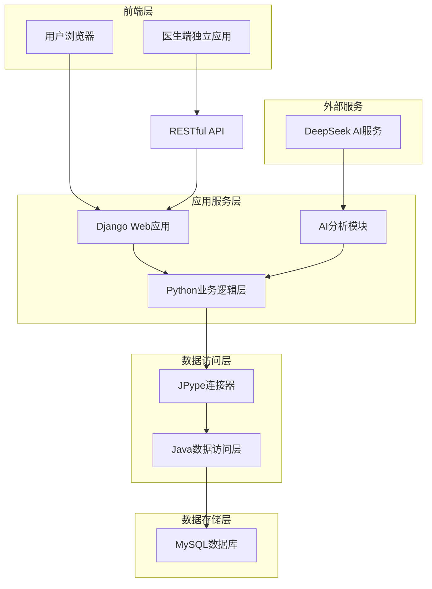
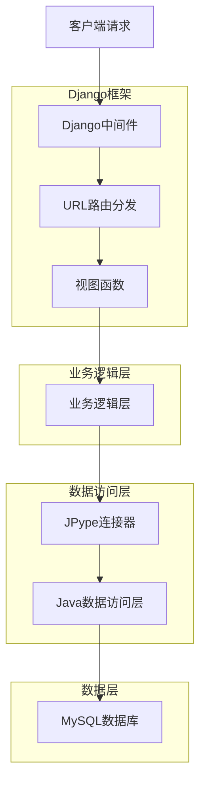
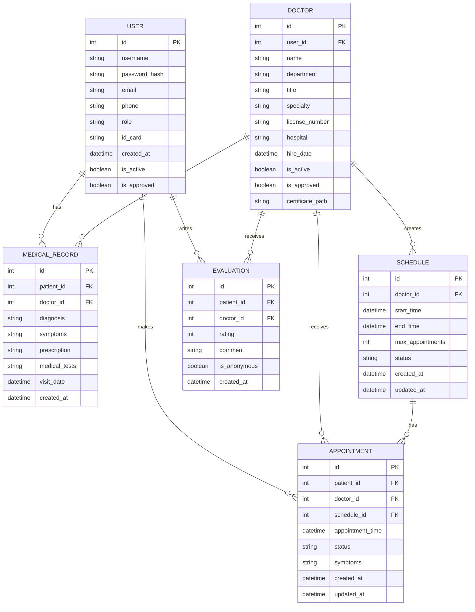

## 1. 架构设计



## 2. 技术描述

- **前端**: Bootstrap 5 + Django模板引擎 + jQuery
- **后端**: Django 4.0+ + Python 3.8+
- **数据访问**: Java + JPype + MyBatis
- **数据库**: MySQL 8.0+
- **AI集成**: DeepSeek API
- **初始化工具**: Django-admin
- **版本控制**: Git

## 3. 路由定义

| 路由 | 用途 |
|------|------|
| / | 系统首页 |
| /auth/login/ | 用户登录 |
| /auth/register/patient/ | 患者注册 |
| /auth/register/doctor/ | 医生注册 |
| /admin/dashboard/ | 管理员控制台 |
| /patient/appointment/ | 患者预约页面 |
| /patient/my-appointments/ | 我的预约 |
| /patient/records/ | 患者病历查看 |
| /doctor/dashboard/ | 医生工作台 |
| /doctor/schedule/ | 我的排班 |
| /doctor/publish-schedule/ | 排班发布 |
| /doctor/records/ | 医生病历管理 |
| /api/doctor/ | 医生信息API |
| /api/appointment/ | 预约管理API |
| /api/medical-record/ | 病历管理API |
| /api/evaluation/ | 评价系统API |
| /api/schedule/ | 排班管理API |
| /api/auth/register/ | 注册API |

## 4. API定义

### 4.1 认证API

**用户登录**
```
POST /api/auth/login/
```

请求参数:
| 参数名 | 参数类型 | 是否必需 | 描述 |
|--------|----------|----------|------|
| username | string | 是 | 用户名或手机号 |
| password | string | 是 | 密码 |
| role | string | 是 | 用户角色(admin/doctor/patient) |

响应参数:
| 参数名 | 参数类型 | 描述 |
|--------|----------|------|
| token | string | JWT令牌 |
| user_id | int | 用户ID |
| role | string | 用户角色 |
| expires_in | int | 过期时间(秒) |

**患者注册**
```
POST /api/auth/register/patient/
```

请求参数:
| 参数名 | 参数类型 | 是否必需 | 描述 |
|--------|----------|----------|------|
| phone | string | 是 | 手机号 |
| password | string | 是 | 密码 |
| name | string | 是 | 姓名 |
| id_card | string | 是 | 身份证号 |
| email | string | 否 | 邮箱地址 |

**医生注册**
```
POST /api/auth/register/doctor/
```

请求参数:
| 参数名 | 参数类型 | 是否必需 | 描述 |
|--------|----------|----------|------|
| phone | string | 是 | 手机号 |
| password | string | 是 | 密码 |
| name | string | 是 | 姓名 |
| license_number | string | 是 | 执业证书编号 |
| department | string | 是 | 所属科室 |
| title | string | 是 | 职称 |
| hospital | string | 是 | 所属医院 |
| email | string | 否 | 邮箱地址 |
| certificate_file | file | 是 | 资质证书文件 |

### 4.2 预约API

**创建预约**
```
POST /api/appointment/create/
```

请求参数:
| 参数名 | 参数类型 | 是否必需 | 描述 |
|--------|----------|----------|------|
| doctor_id | int | 是 | 医生ID |
| patient_id | int | 是 | 患者ID |
| appointment_time | datetime | 是 | 预约时间 |
| symptoms | string | 否 | 症状描述 |
| department | string | 是 | 科室 |

**查询预约**
```
GET /api/appointment/list/
```

查询参数:
| 参数名 | 参数类型 | 是否必需 | 描述 |
|--------|----------|----------|------|
| user_id | int | 是 | 用户ID |
| role | string | 是 | 角色 |
| date | date | 否 | 日期筛选 |
| status | string | 否 | 状态筛选 |

### 4.3 排班管理API

**创建排班**
```
POST /api/schedule/create/
```

请求参数:
| 参数名 | 参数类型 | 是否必需 | 描述 |
|--------|----------|----------|------|
| doctor_id | int | 是 | 医生ID |
| start_time | datetime | 是 | 开始时间 |
| end_time | datetime | 是 | 结束时间 |
| max_appointments | int | 是 | 最大预约数 |

**查询医生排班**
```
GET /api/schedule/doctor/{doctor_id}/
```

查询参数:
| 参数名 | 参数类型 | 是否必需 | 描述 |
|--------|----------|----------|------|
| doctor_id | int | 是 | 医生ID |
| start_date | date | 否 | 开始日期 |
| end_date | date | 否 | 结束日期 |
| status | string | 否 | 排班状态 |

**更新排班状态**
```
PUT /api/schedule/{schedule_id}/status/
```

请求参数:
| 参数名 | 参数类型 | 是否必需 | 描述 |
|--------|----------|----------|------|
| status | string | 是 | 排班状态(active/inactive) |

### 4.3 病历API

**创建病历**
```
POST /api/medical-record/create/
```

请求参数:
| 参数名 | 参数类型 | 是否必需 | 描述 |
|--------|----------|----------|------|
| patient_id | int | 是 | 患者ID |
| doctor_id | int | 是 | 医生ID |
| diagnosis | string | 是 | 诊断结果 |
| symptoms | string | 是 | 症状描述 |
| prescription | string | 否 | 处方信息 |
| medical_tests | string | 否 | 检查项目 |

## 5. 服务器架构图



## 6. 数据模型

### 6.1 数据模型定义



### 6.2 数据定义语言

**用户表 (users)**
```sql
CREATE TABLE users (
    id INT AUTO_INCREMENT PRIMARY KEY,
    username VARCHAR(50) UNIQUE NOT NULL,
    password_hash VARCHAR(255) NOT NULL,
    email VARCHAR(100) UNIQUE,
    phone VARCHAR(20) UNIQUE NOT NULL,
    role ENUM('admin', 'doctor', 'patient') NOT NULL,
    id_card VARCHAR(18) UNIQUE,
    is_approved BOOLEAN DEFAULT FALSE,
    created_at TIMESTAMP DEFAULT CURRENT_TIMESTAMP,
    updated_at TIMESTAMP DEFAULT CURRENT_TIMESTAMP ON UPDATE CURRENT_TIMESTAMP,
    is_active BOOLEAN DEFAULT TRUE,
    INDEX idx_username (username),
    INDEX idx_phone (phone),
    INDEX idx_id_card (id_card)
);
```

**医生表 (doctors)**
```sql
CREATE TABLE doctors (
    id INT AUTO_INCREMENT PRIMARY KEY,
    user_id INT UNIQUE NOT NULL,
    name VARCHAR(50) NOT NULL,
    department VARCHAR(50) NOT NULL,
    title VARCHAR(50),
    specialty VARCHAR(200),
    license_number VARCHAR(50) UNIQUE NOT NULL,
    hospital VARCHAR(100) NOT NULL,
    certificate_path VARCHAR(255),
    hire_date DATE,
    is_active BOOLEAN DEFAULT TRUE,
    is_approved BOOLEAN DEFAULT FALSE,
    created_at TIMESTAMP DEFAULT CURRENT_TIMESTAMP,
    updated_at TIMESTAMP DEFAULT CURRENT_TIMESTAMP ON UPDATE CURRENT_TIMESTAMP,
    FOREIGN KEY (user_id) REFERENCES users(id),
    INDEX idx_department (department),
    INDEX idx_name (name),
    INDEX idx_license (license_number)
);
```

**预约表 (appointments)**
```sql
CREATE TABLE appointments (
    id INT AUTO_INCREMENT PRIMARY KEY,
    patient_id INT NOT NULL,
    doctor_id INT NOT NULL,
    schedule_id INT NOT NULL,
    appointment_time DATETIME NOT NULL,
    status ENUM('pending', 'confirmed', 'completed', 'cancelled') DEFAULT 'pending',
    symptoms TEXT,
    duration_minutes INT DEFAULT 30,
    created_at TIMESTAMP DEFAULT CURRENT_TIMESTAMP,
    updated_at TIMESTAMP DEFAULT CURRENT_TIMESTAMP ON UPDATE CURRENT_TIMESTAMP,
    FOREIGN KEY (patient_id) REFERENCES users(id),
    FOREIGN KEY (doctor_id) REFERENCES doctors(id),
    FOREIGN KEY (schedule_id) REFERENCES schedules(id),
    INDEX idx_patient_time (patient_id, appointment_time),
    INDEX idx_doctor_time (doctor_id, appointment_time),
    INDEX idx_schedule (schedule_id),
    INDEX idx_status (status)
);
```

**病历表 (medical_records)**
```sql
CREATE TABLE medical_records (
    id INT AUTO_INCREMENT PRIMARY KEY,
    patient_id INT NOT NULL,
    doctor_id INT NOT NULL,
    diagnosis VARCHAR(500) NOT NULL,
    symptoms TEXT,
    prescription TEXT,
    medical_tests TEXT,
    visit_date DATETIME DEFAULT CURRENT_TIMESTAMP,
    created_at TIMESTAMP DEFAULT CURRENT_TIMESTAMP,
    FOREIGN KEY (patient_id) REFERENCES users(id),
    FOREIGN KEY (doctor_id) REFERENCES doctors(id),
    INDEX idx_patient_visit (patient_id, visit_date DESC),
    INDEX idx_doctor_visit (doctor_id, visit_date DESC)
);
```

**排班表 (schedules)**
```sql
CREATE TABLE schedules (
    id INT AUTO_INCREMENT PRIMARY KEY,
    doctor_id INT NOT NULL,
    start_time DATETIME NOT NULL,
    end_time DATETIME NOT NULL,
    max_appointments INT DEFAULT 10,
    status ENUM('active', 'inactive', 'full') DEFAULT 'active',
    current_appointments INT DEFAULT 0,
    created_at TIMESTAMP DEFAULT CURRENT_TIMESTAMP,
    updated_at TIMESTAMP DEFAULT CURRENT_TIMESTAMP ON UPDATE CURRENT_TIMESTAMP,
    FOREIGN KEY (doctor_id) REFERENCES doctors(id),
    INDEX idx_doctor_start_time (doctor_id, start_time),
    INDEX idx_start_end_time (start_time, end_time),
    INDEX idx_status (status)
);
```

**评价表 (evaluations)**
```sql
CREATE TABLE evaluations (
    id INT AUTO_INCREMENT PRIMARY KEY,
    patient_id INT NOT NULL,
    doctor_id INT NOT NULL,
    rating TINYINT CHECK (rating >= 1 AND rating <= 5),
    comment TEXT,
    is_anonymous BOOLEAN DEFAULT FALSE,
    created_at TIMESTAMP DEFAULT CURRENT_TIMESTAMP,
    FOREIGN KEY (patient_id) REFERENCES users(id),
    FOREIGN KEY (doctor_id) REFERENCES doctors(id),
    INDEX idx_doctor_rating (doctor_id, rating),
    INDEX idx_created_at (created_at DESC)
);
```

## 7. 安全与性能

### 7.1 安全措施
- 密码使用PBKDF2算法加密存储
- 实现JWT令牌认证机制
- 敏感数据使用AES加密
- 实现操作审计日志记录
- 防SQL注入和XSS攻击

### 7.2 性能优化
- 数据库连接池配置
- Redis缓存热点数据
- 分页查询大数据量
- 索引优化查询性能
- 静态资源CDN加速

### 7.3 监控指标
- 支持1000+并发用户
- 页面响应时间<2秒
- 数据库查询优化
- API接口限流控制
- 系统资源使用率监控