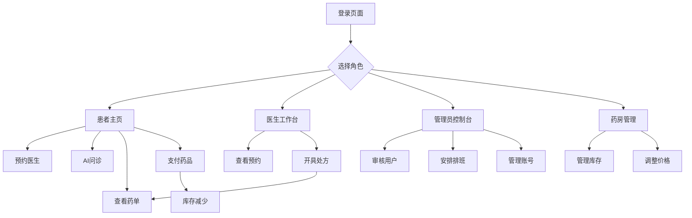

## 1. 产品概述

这是一个集成化的医院医疗系统，整合了患者预约、医生诊疗、药房管理和AI问诊功能。系统支持多角色登录，提供完整的医疗流程管理，从患者预约到药品购买的闭环服务。

目标用户包括患者、医生、管理员和药房工作人员，旨在提高医院运营效率和患者就医体验。

## 2. 核心功能

### 2.1 用户角色

| 角色     | 注册方式     | 核心权限                       |
| ------ | -------- | -------------------------- |
| 患者     | 手机号注册    | 预约医生、AI问诊、查看药单、支付药品、修改个人资料 |
| 医生     | 管理员审核后激活 | 查看预约、开具处方、管理患者信息           |
| 管理员    | 系统预设     | 审核用户、安排医生排班、管理所有账号         |
| 药房工作人员 | 管理员审核后激活 | 管理药品库存、调整价格                |

### 2.2 功能模块

系统包含以下主要页面：

1. **登录注册页面**：手机号、密码登录，注册时增加姓名选项
2. **患者主页**：预约医生、AI问诊入口、个人药单、资料管理
3. **医生工作台**：查看预约患者、开具处方、患者管理
4. **管理员控制台**：用户审核、医生排班、账号管理
5. **药房管理**：药品库存管理、价格调整

### 2.3 页面详情

| 页面名称   | 模块名称 | 功能描述                 |
| ------ | ---- | -------------------- |
| 登录注册页面 | 登录模块 | 输入手机号、密码，选择身份角色登录    |
| 登录注册页面 | 注册模块 | 输入手机号、密码、姓名，选择角色注册   |
| 患者主页   | 预约医生 | 浏览可预约医生列表，选择时间段预约    |
| 患者主页   | AI问诊 | 仅患者可用，输入症状获取AI建议     |
| 患者主页   | 我的药单 | 查看医生开具的药单，支持在线支付     |
| 患者主页   | 个人资料 | 修改姓名、手机号等个人信息        |
| 医生工作台  | 预约管理 | 查看预约患者列表，显示患者姓名和预约时间 |
| 医生工作台  | 开具处方 | 为患者开具处方药和非处方药        |
| 医生工作台  | 患者记录 | 查看历史患者信息和处方记录        |
| 管理员控制台 | 用户审核 | 审核医生和药房工作人员注册申请      |
| 管理员控制台 | 排班管理 | 安排医生工作时间和排班表         |
| 管理员控制台 | 账号管理 | 删除或禁用任何用户账号          |
| 药房管理   | 药品库存 | 增加新药品，下架过期药品         |
| 药房管理   | 价格调整 | 修改药品销售价格             |

## 3. 核心流程

### 患者流程

患者注册登录 → 预约医生 → 医生诊疗后开具处方 → 患者查看药单 → 在线支付 → 药房库存自动减少

### 医生流程

医生注册（需审核）→ 登录查看预约 → 为患者诊疗 → 开具处方 → 处方自动同步到患者药单

### 管理员流程

管理员登录 → 审核新注册用户 → 安排医生排班 → 管理所有用户账号

### 药房工作人员流程

药房人员注册（需审核）→ 登录管理药品 → 调整库存和价格

## 4. 用户界面设计

### 4.1 设计风格

* **主色调**：医疗蓝色（#1890FF）和白色为主，体现专业医疗形象

* **按钮样式**：圆角矩形，主要操作用蓝色，危险操作用红色

* **字体**：系统默认字体，标题16px，正文14px

* **布局风格**：左侧导航+右侧内容区域的卡片式布局

* **图标风格**：使用简洁的线性医疗相关图标

### 4.2 页面设计概述

| 页面名称   | 模块名称 | UI元素                           |
| ------ | ---- | ------------------------------ |
| 登录注册页面 | 登录表单 | 居中卡片布局，蓝色主题，手机号和密码输入框，角色选择下拉菜单 |
| 患者主页   | 功能导航 | 顶部导航栏，左侧功能菜单，右侧内容区域            |
| 患者主页   | 预约列表 | 表格展示可预约医生，包含姓名、科室、时间段选择        |
| 医生工作台  | 预约面板 | 日历视图显示预约安排，列表显示患者信息            |
| 管理员控制台 | 审核列表 | 表格展示待审核用户，支持批量审核操作             |
| 药房管理   | 药品列表 | 表格展示药品信息，支持搜索和筛选功能             |

### 4.3 响应式设计

采用桌面端优先设计，适配平板和桌面设备。主要考虑医院内部使用场景，以大屏显示为主，移动端仅作基础适配。
