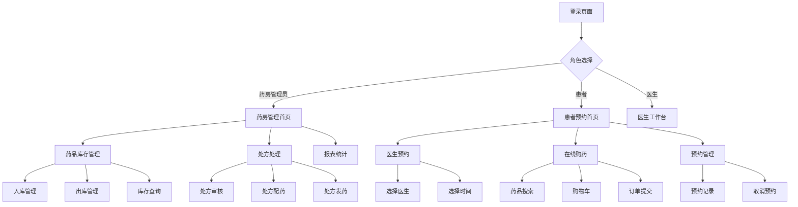

## 1. 产品概述

本系统是一个综合性药房管理与患者预约平台，旨在为药房提供完整的药品库存管理、处方处理、销售统计等功能，同时为患者提供在线预约、购药、医生信息查询等服务。系统打通药房内部管理与患者服务，实现数据互通和统一认证，提升医疗服务效率和患者体验。

- 解决传统药房手工管理效率低下、易出错的问题
- 为药房工作人员提供数字化管理工具
- 为患者提供便捷的在线预约和购药渠道
- 建立统一的患者-药房-医生数据链路

## 2. 核心功能

### 2.1 用户角色

| 角色 | 注册方式 | 核心权限 |
|------|----------|----------|
| 系统管理员 | 后台创建 | 系统配置、用户管理、数据审计 |
| 药房管理员 | 管理员创建 | 药品管理、库存管理、报表查看 |
| 药房操作员 | 管理员创建 | 处方处理、药品出入库 |
| 患者 | 手机号注册 | 在线预约、购药、查看个人记录 |
| 医生 | 管理员审核 | 处方开具、患者信息查看 |

### 2.2 功能模块

本系统包含以下核心页面：

1. **登录页面**：用户认证、角色选择、密码找回
2. **药房管理首页**：库存概览、待处理处方、快捷操作
3. **药品库存管理页**：药品列表、入库出库、库存查询、有效期管理
4. **处方处理页**：处方接收、审核、配药、发药流程
5. **药品信息管理页**：药品基本信息维护、价格管理、分类管理
6. **报表统计页**：销售统计、库存报表、业务分析
7. **患者预约首页**：医生列表、预约时间选择、个人信息
8. **患者购药页面**：药品搜索、购物车、订单提交
9. **预约管理页**：预约记录、取消预约、提醒设置
10. **个人中心页**：个人信息、历史记录、设置管理

### 2.3 页面详情

| 页面名称 | 模块名称 | 功能描述 |
|----------|----------|----------|
| 登录页面 | 用户认证 | 支持手机号/邮箱登录，角色权限验证，忘记密码功能 |
| 登录页面 | 统一认证 | 单点登录，药房和预约系统共用认证 |
| 药房管理首页 | 库存概览 | 实时显示库存总量、低库存预警、过期药品提醒 |
| 药房管理首页 | 待处理处方 | 显示待审核、待配药、待发药处方数量 |
| 药房管理首页 | 快捷操作 | 快速入库、快速出库、处方处理入口 |
| 药品库存管理页 | 药品列表 | 分页显示药品信息，支持搜索和筛选 |
| 药品库存管理页 | 入库管理 | 扫描条码入库，批量入库，入库记录查询 |
| 药品库存管理页 | 出库管理 | 处方出库、销售出库、出库记录查询 |
| 药品库存管理页 | 库存查询 | 多条件查询库存，库存预警设置 |
| 药品库存管理页 | 有效期管理 | 近效期预警，过期药品自动标记 |
| 处方处理页 | 处方接收 | 接收电子处方，显示患者信息和药品清单 |
| 处方处理页 | 处方审核 | 药师审核处方合理性，标记问题处方 |
| 处方处理页 | 处方配药 | 按处方配药，扫描确认，缺药提醒 |
| 处方处理页 | 处方发药 | 核对患者身份，发药确认，用药指导 |
| 药品信息管理页 | 基本信息维护 | 药品名称、规格、厂家、批准文号管理 |
| 药品信息管理页 | 价格管理 | 进价、售价调整，价格历史记录 |
| 药品信息管理页 | 分类管理 | 药品分类创建、修改，分类树形结构 |
| 报表统计页 | 销售统计 | 日销售、月销售、药品销售排行 |
| 报表统计页 | 库存报表 | 库存变动、库存周转率、滞销药品 |
| 报表统计页 | 业务分析 | 处方量统计、患者流量分析 |
| 患者预约首页 | 医生列表 | 显示可预约医生，专业信息、出诊时间 |
| 患者预约首页 | 预约选择 | 选择科室、医生、预约时间段 |
| 患者购药页面 | 药品搜索 | 按名称、症状搜索药品，显示库存状态 |
| 患者购药页面 | 购物车 | 添加药品、修改数量、删除商品 |
| 患者购药页面 | 订单提交 | 选择配送方式、支付方式，提交订单 |
| 预约管理页 | 预约记录 | 查看历史预约、待就诊预约 |
| 预约管理页 | 取消预约 | 在规定时间内取消预约，退款处理 |
| 预约管理页 | 提醒设置 | 预约提醒、用药提醒设置 |
| 个人中心页 | 个人信息 | 基本信息、联系方式、过敏史管理 |
| 个人中心页 | 历史记录 | 就诊记录、购药记录、处方记录 |

## 3. 核心流程

### 3.1 药房管理工作流程

药房管理员登录系统后，首先查看首页的库存概览和待处理处方。对于新到药品，通过入库管理模块录入系统；处理处方时，先接收电子处方，药师审核通过后进行配药，最后发药给患者。系统实时更新库存数据，自动生成相关报表。

### 3.2 患者预约购药流程

患者注册登录后，可以浏览医生信息并选择预约时间，系统显示医生的专业信息和出诊安排。预约成功后，患者可以在预约管理页面查看和取消预约。需要购药时，患者可以在线搜索药品，系统显示库存状态和价格，支持处方药和非处方药购买，处方药需要上传处方或医生在线开具。

### 3.3 系统集成流程

药房系统和预约系统通过统一的用户认证和数据接口实现互通。患者在预约系统中的信息可以同步到药房系统，医生开具的电子处方直接传输到药房，药房处理状态实时反馈给医生和患者。所有数据传输都经过加密处理，确保患者隐私安全。

## 4. 用户界面设计

### 4.1 设计风格

- **主色调**：医疗蓝 (#1890ff) 作为主色，白色为背景，绿色 (#52c41a) 表示成功状态，红色 (#ff4d4f) 表示警告和错误
- **按钮样式**：采用圆角矩形设计，主要操作为实心按钮，次要操作为线框按钮
- **字体选择**：中文使用思源黑体，英文使用Roboto，正文字号14px，标题字号16-20px
- **布局风格**：采用卡片式布局，信息分组清晰，支持响应式网格系统
- **图标风格**：使用线性图标，简洁明了，符合医疗行业专业感

### 4.2 页面设计概述

| 页面名称 | 模块名称 | UI元素 |
|----------|----------|--------|
| 登录页面 | 认证表单 | 居中卡片布局，蓝白配色，包含logo、输入框、登录按钮 |
| 药房管理首页 | 数据概览 | 顶部统计卡片，显示关键指标数字和趋势图 |
| 药房管理首页 | 快捷入口 | 宫格布局的快捷操作按钮，图标+文字组合 |
| 药品库存管理页 | 药品列表 | 表格形式展示，支持排序、筛选、分页 |
| 药品库存管理页 | 操作面板 | 顶部工具栏，包含搜索框、筛选器、批量操作按钮 |
| 处方处理页 | 处方详情 | 左侧患者信息，右侧药品清单，分步骤操作流程 |
| 处方处理页 | 处理进度 | 步骤条显示当前处理阶段，支持回退操作 |
| 患者预约首页 | 医生卡片 | 卡片式展示医生信息，包含头像、专业、评分 |
| 患者预约首页 | 预约日历 | 月历视图，可预约时间段高亮显示 |
| 患者购药页面 | 药品展示 | 网格布局展示药品，包含图片、名称、价格 |
| 患者购药页面 | 购物车 | 侧边抽屉式购物车，实时显示商品数量和总价 |
| 报表统计页 | 图表展示 | 柱状图、饼图、折线图等多种图表形式 |
| 报表统计页 | 数据筛选 | 时间范围选择器，支持自定义时间段 |

### 4.3 响应式设计

- **桌面端优先**：基础设计以1920x1080分辨率为标准，支持更大屏幕适配
- **平板适配**：768px-1024px屏幕采用自适应布局，侧边栏可收起
- **手机优化**：小于768px屏幕采用移动端专用布局，底部导航栏，手势操作优化
- **触摸交互**：移动端支持滑动、长按、捏合等手势操作，按钮大小适配手指触摸
- **性能优化**：移动端采用懒加载、图片压缩、缓存策略提升加载速度