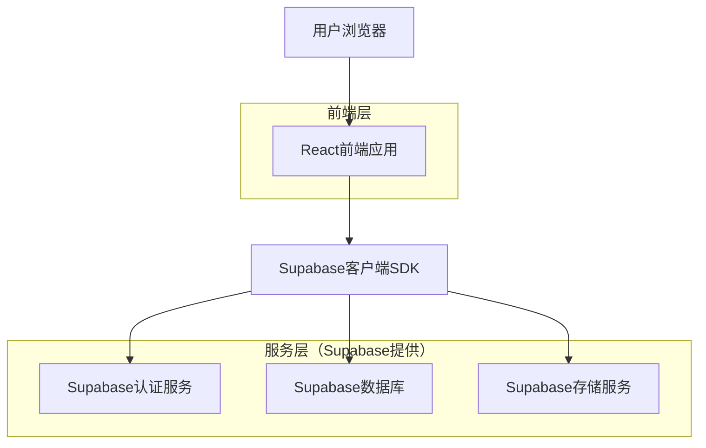
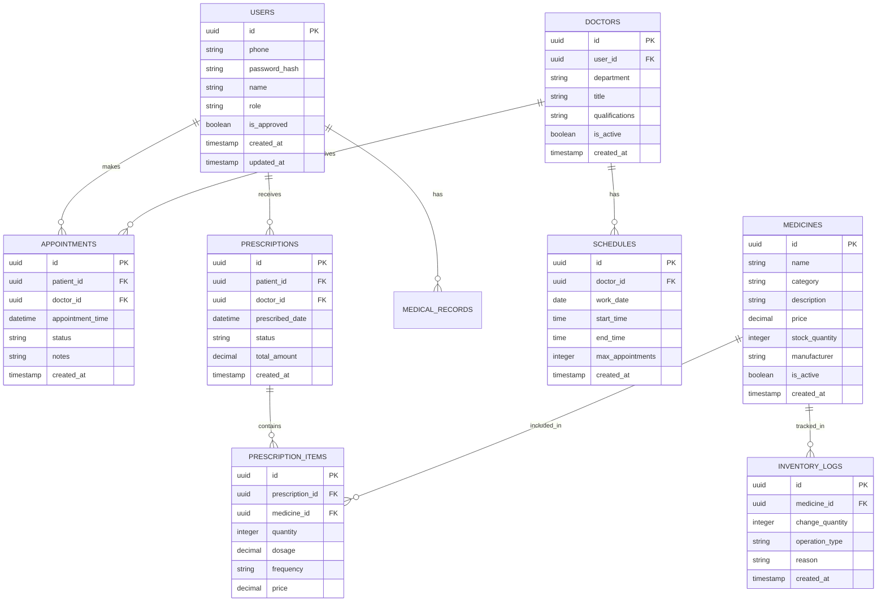

## 1. 架构设计



## 2. 技术描述

- **前端**: React@18 + TailwindCSS@3 + Vite
- **初始化工具**: vite-init
- **后端**: Supabase（后端即服务）
- **认证**: Supabase Auth（手机号+密码）
- **数据库**: Supabase PostgreSQL
- **实时功能**: Supabase Realtime（用于预约状态同步）

## 3. 路由定义

| 路由 | 用途 |
|-------|---------|
| / | 登录页面 |
| /register | 注册页面 |
| /patient | 患者主页 |
| /patient/appointment | 预约医生页面 |
| /patient/ai-consult | AI问诊页面 |
| /patient/prescriptions | 我的药单页面 |
| /patient/profile | 患者资料页面 |
| /doctor | 医生工作台 |
| /doctor/appointments | 预约管理页面 |
| /doctor/prescriptions | 开具处方页面 |
| /admin | 管理员控制台 |
| /admin/users | 用户审核页面 |
| /admin/schedule | 排班管理页面 |
| /pharmacy | 药房管理页面 |
| /pharmacy/inventory | 药品库存页面 |

## 4. 数据模型

### 4.1 数据模型定义



### 4.2 数据定义语言

用户表 (users)
```sql
-- 创建用户表
CREATE TABLE users (
    id UUID PRIMARY KEY DEFAULT gen_random_uuid(),
    phone VARCHAR(20) UNIQUE NOT NULL,
    password_hash VARCHAR(255) NOT NULL,
    name VARCHAR(100) NOT NULL,
    role VARCHAR(20) NOT NULL CHECK (role IN ('patient', 'doctor', 'admin', 'pharmacist')),
    is_approved BOOLEAN DEFAULT false,
    created_at TIMESTAMP WITH TIME ZONE DEFAULT NOW(),
    updated_at TIMESTAMP WITH TIME ZONE DEFAULT NOW()
);

-- 创建索引
CREATE INDEX idx_users_phone ON users(phone);
CREATE INDEX idx_users_role ON users(role);

-- 设置权限
GRANT SELECT ON users TO anon;
GRANT ALL PRIVILEGES ON users TO authenticated;
```

医生表 (doctors)
```sql
-- 创建医生表
CREATE TABLE doctors (
    id UUID PRIMARY KEY DEFAULT gen_random_uuid(),
    user_id UUID REFERENCES users(id) ON DELETE CASCADE,
    department VARCHAR(100) NOT NULL,
    title VARCHAR(100) NOT NULL,
    qualifications TEXT,
    is_active BOOLEAN DEFAULT true,
    created_at TIMESTAMP WITH TIME ZONE DEFAULT NOW()
);

-- 设置权限
GRANT SELECT ON doctors TO anon;
GRANT ALL PRIVILEGES ON doctors TO authenticated;
```

预约表 (appointments)
```sql
-- 创建预约表
CREATE TABLE appointments (
    id UUID PRIMARY KEY DEFAULT gen_random_uuid(),
    patient_id UUID REFERENCES users(id) ON DELETE CASCADE,
    doctor_id UUID REFERENCES users(id) ON DELETE CASCADE,
    appointment_time TIMESTAMP WITH TIME ZONE NOT NULL,
    status VARCHAR(20) DEFAULT 'scheduled' CHECK (status IN ('scheduled', 'completed', 'cancelled')),
    notes TEXT,
    created_at TIMESTAMP WITH TIME ZONE DEFAULT NOW()
);

-- 创建索引
CREATE INDEX idx_appointments_patient_id ON appointments(patient_id);
CREATE INDEX idx_appointments_doctor_id ON appointments(doctor_id);
CREATE INDEX idx_appointments_time ON appointments(appointment_time);

-- 设置权限
GRANT SELECT ON appointments TO anon;
GRANT ALL PRIVILEGES ON appointments TO authenticated;
```

药单表 (prescriptions)
```sql
-- 创建药单表
CREATE TABLE prescriptions (
    id UUID PRIMARY KEY DEFAULT gen_random_uuid(),
    patient_id UUID REFERENCES users(id) ON DELETE CASCADE,
    doctor_id UUID REFERENCES users(id) ON DELETE CASCADE,
    prescribed_date TIMESTAMP WITH TIME ZONE DEFAULT NOW(),
    status VARCHAR(20) DEFAULT 'pending' CHECK (status IN ('pending', 'paid', 'dispensed')),
    total_amount DECIMAL(10,2) DEFAULT 0,
    created_at TIMESTAMP WITH TIME ZONE DEFAULT NOW()
);

-- 设置权限
GRANT SELECT ON prescriptions TO anon;
GRANT ALL PRIVILEGES ON prescriptions TO authenticated;
```

药品表 (medicines)
```sql
-- 创建药品表
CREATE TABLE medicines (
    id UUID PRIMARY KEY DEFAULT gen_random_uuid(),
    name VARCHAR(200) NOT NULL,
    category VARCHAR(100) NOT NULL,
    description TEXT,
    price DECIMAL(10,2) NOT NULL,
    stock_quantity INTEGER DEFAULT 0,
    manufacturer VARCHAR(200),
    is_active BOOLEAN DEFAULT true,
    created_at TIMESTAMP WITH TIME ZONE DEFAULT NOW()
);

-- 创建索引
CREATE INDEX idx_medicines_name ON medicines(name);
CREATE INDEX idx_medicines_category ON medicines(category);

-- 设置权限
GRANT SELECT ON medicines TO anon;
GRANT ALL PRIVILEGES ON medicines TO authenticated;
```

### 4.3 Supabase策略设置

-- 患者只能查看自己的预约
```sql
CREATE POLICY "patients_view_own_appointments" ON appointments
    FOR SELECT USING (
        auth.uid() = patient_id OR 
        EXISTS (
            SELECT 1 FROM users 
            WHERE users.id = auth.uid() 
            AND users.role = 'doctor'
        )
    );
```

-- 医生只能管理自己的排班
```sql
CREATE POLICY "doctors_manage_own_schedules" ON schedules
    FOR ALL USING (
        EXISTS (
            SELECT 1 FROM doctors 
            WHERE doctors.user_id = auth.uid()
        )
    );
```

-- 药房工作人员可以管理药品库存
```sql
CREATE POLICY "pharmacists_manage_medicines" ON medicines
    FOR ALL USING (
        EXISTS (
            SELECT 1 FROM users 
            WHERE users.id = auth.uid() 
            AND users.role = 'pharmacist'
        )
    );
```