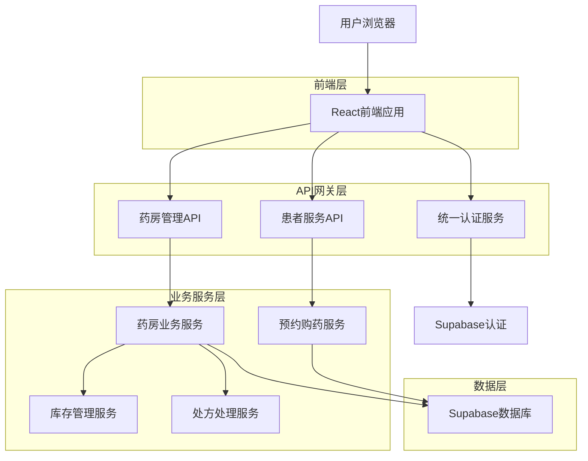
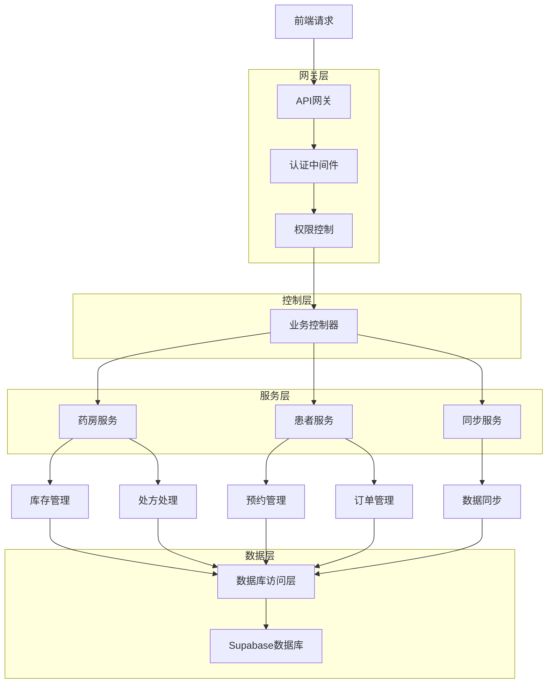
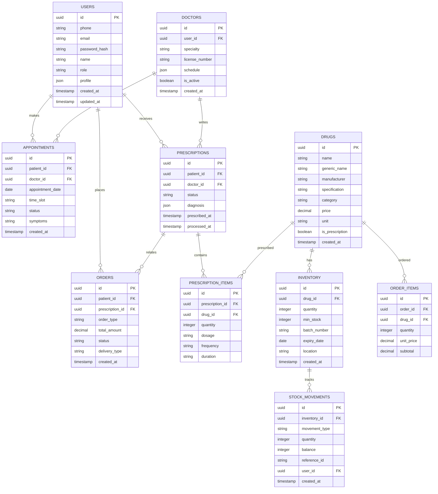

## 1. 架构设计



## 2. 技术描述

- **前端框架**: React@18 + TypeScript + Vite
- **UI组件库**: Ant Design@5 + Tailwind CSS@3
- **状态管理**: Zustand + React Query
- **路由管理**: React Router@6
- **初始化工具**: vite-init
- **后端服务**: Node.js@18 + Express@4
- **数据库**: Supabase (PostgreSQL)
- **身份认证**: Supabase Auth + JWT
- **文件存储**: Supabase Storage
- **实时通信**: Supabase Realtime
- **日志审计**: Winston + Morgan
- **数据验证**: Zod + Joi

## 3. 路由定义

| 路由路径 | 页面组件 | 功能描述 |
|----------|----------|----------|
| / | LoginPage | 统一登录页面 |
| /dashboard/pharmacy | PharmacyDashboard | 药房管理首页 |
| /dashboard/patient | PatientDashboard | 患者预约首页 |
| /dashboard/doctor | DoctorDashboard | 医生工作台 |
| /pharmacy/inventory | InventoryManagement | 药品库存管理 |
| /pharmacy/prescriptions | PrescriptionManagement | 处方处理页面 |
| /pharmacy/drugs | DrugInformation | 药品信息管理 |
| /pharmacy/reports | ReportsAndAnalytics | 报表统计页面 |
| /patient/appointments | AppointmentBooking | 在线预约页面 |
| /patient/pharmacy | OnlinePharmacy | 在线购药页面 |
| /patient/my-appointments | MyAppointments | 我的预约管理 |
| /patient/orders | MyOrders | 我的订单页面 |
| /profile | ProfilePage | 个人中心 |
| /admin/users | UserManagement | 用户管理（管理员） |
| /admin/audit | AuditLogs | 审计日志（管理员） |

## 4. API定义

### 4.1 认证相关API

**用户登录**
```
POST /api/auth/login
```

请求参数：
| 参数名称 | 参数类型 | 是否必需 | 描述 |
|----------|----------|----------|------|
| phone | string | true | 手机号 |
| password | string | true | 密码 |
| role | string | true | 用户角色 |

响应数据：
| 参数名称 | 参数类型 | 描述 |
|----------|----------|------|
| token | string | JWT访问令牌 |
| refreshToken | string | 刷新令牌 |
| user | object | 用户信息 |
| role | string | 用户角色 |

### 4.2 药房管理API

**药品库存查询**
```
GET /api/pharmacy/inventory
```

查询参数：
| 参数名称 | 参数类型 | 是否必需 | 描述 |
|----------|----------|----------|------|
| page | number | false | 页码，默认1 |
| pageSize | number | false | 每页条数，默认20 |
| keyword | string | false | 搜索关键词 |
| category | string | false | 药品分类 |
| lowStock | boolean | false | 是否只显示低库存 |

**药品入库**
```
POST /api/pharmacy/inventory/inbound
```

请求体：
| 参数名称 | 参数类型 | 是否必需 | 描述 |
|----------|----------|----------|------|
| drugId | string | true | 药品ID |
| quantity | number | true | 入库数量 |
| batchNumber | string | true | 批号 |
| expiryDate | string | true | 有效期 |
| supplier | string | true | 供应商 |

**处方处理**
```
POST /api/pharmacy/prescriptions/{id}/process
```

请求体：
| 参数名称 | 参数类型 | 是否必需 | 描述 |
|----------|----------|------|
| action | string | true | 处理动作：audit/dispense/deliver |
| comments | string | false | 处理意见 |
| dispensedItems | array | false | 配药清单 |

### 4.3 患者服务API

**在线预约**
```
POST /api/patient/appointments
```

请求体：
| 参数名称 | 参数类型 | 是否必需 | 描述 |
|----------|----------|------|
| doctorId | string | true | 医生ID |
| appointmentDate | string | true | 预约日期 |
| timeSlot | string | true | 时间段 |
| symptoms | string | false | 症状描述 |

**在线购药**
```
POST /api/patient/orders
```

请求体：
| 参数名称 | 参数类型 | 是否必需 | 描述 |
|----------|----------|------|
| items | array | true | 购药清单 |
| prescriptionId | string | false | 处方ID（处方药必需） |
| deliveryType | string | true | 配送方式：pickup/delivery |
| paymentMethod | string | true | 支付方式 |

### 4.4 数据同步API

**患者信息同步**
```
POST /api/sync/patient-info
```

**处方信息传输**
```
POST /api/sync/prescription
```

## 5. 服务器架构



## 6. 数据模型

### 6.1 实体关系图



### 6.2 数据定义语言

**用户表**
```sql
-- 创建用户表
CREATE TABLE users (
    id UUID PRIMARY KEY DEFAULT gen_random_uuid(),
    phone VARCHAR(20) UNIQUE,
    email VARCHAR(255) UNIQUE,
    password_hash VARCHAR(255) NOT NULL,
    name VARCHAR(100) NOT NULL,
    role VARCHAR(20) NOT NULL CHECK (role IN ('admin', 'pharmacy_manager', 'pharmacy_staff', 'doctor', 'patient')),
    profile JSONB DEFAULT '{}',
    is_active BOOLEAN DEFAULT true,
    created_at TIMESTAMP WITH TIME ZONE DEFAULT NOW(),
    updated_at TIMESTAMP WITH TIME ZONE DEFAULT NOW()
);

-- 创建索引
CREATE INDEX idx_users_phone ON users(phone);
CREATE INDEX idx_users_email ON users(email);
CREATE INDEX idx_users_role ON users(role);
```

**药品表**
```sql
-- 创建药品表
CREATE TABLE drugs (
    id UUID PRIMARY KEY DEFAULT gen_random_uuid(),
    name VARCHAR(255) NOT NULL,
    generic_name VARCHAR(255),
    manufacturer VARCHAR(255),
    specification VARCHAR(255),
    category VARCHAR(100),
    price DECIMAL(10,2) NOT NULL DEFAULT 0,
    unit VARCHAR(50),
    is_prescription BOOLEAN DEFAULT false,
    barcode VARCHAR(255) UNIQUE,
    created_at TIMESTAMP WITH TIME ZONE DEFAULT NOW(),
    updated_at TIMESTAMP WITH TIME ZONE DEFAULT NOW()
);

-- 创建索引
CREATE INDEX idx_drugs_name ON drugs(name);
CREATE INDEX idx_drugs_category ON drugs(category);
CREATE INDEX idx_drugs_barcode ON drugs(barcode);
```

**库存表**
```sql
-- 创建库存表
CREATE TABLE inventory (
    id UUID PRIMARY KEY DEFAULT gen_random_uuid(),
    drug_id UUID REFERENCES drugs(id),
    quantity INTEGER NOT NULL DEFAULT 0,
    min_stock INTEGER DEFAULT 10,
    batch_number VARCHAR(100),
    expiry_date DATE,
    location VARCHAR(255),
    created_at TIMESTAMP WITH TIME ZONE DEFAULT NOW(),
    updated_at TIMESTAMP WITH TIME ZONE DEFAULT NOW()
);

-- 创建索引
CREATE INDEX idx_inventory_drug_id ON inventory(drug_id);
CREATE INDEX idx_inventory_expiry_date ON inventory(expiry_date);
CREATE INDEX idx_inventory_low_stock ON inventory(quantity) WHERE quantity <= min_stock;
```

**处方表**
```sql
-- 创建处方表
CREATE TABLE prescriptions (
    id UUID PRIMARY KEY DEFAULT gen_random_uuid(),
    patient_id UUID REFERENCES users(id),
    doctor_id UUID REFERENCES users(id),
    status VARCHAR(50) DEFAULT 'pending' CHECK (status IN ('pending', 'audited', 'dispensing', 'dispensed', 'delivered')),
    diagnosis JSONB DEFAULT '{}',
    prescribed_at TIMESTAMP WITH TIME ZONE DEFAULT NOW(),
    processed_at TIMESTAMP WITH TIME ZONE,
    created_at TIMESTAMP WITH TIME ZONE DEFAULT NOW()
);

-- 创建索引
CREATE INDEX idx_prescriptions_patient_id ON prescriptions(patient_id);
CREATE INDEX idx_prescriptions_doctor_id ON prescriptions(doctor_id);
CREATE INDEX idx_prescriptions_status ON prescriptions(status);
```

**预约表**
```sql
-- 创建预约表
CREATE TABLE appointments (
    id UUID PRIMARY KEY DEFAULT gen_random_uuid(),
    patient_id UUID REFERENCES users(id),
    doctor_id UUID REFERENCES users(id),
    appointment_date DATE NOT NULL,
    time_slot VARCHAR(50) NOT NULL,
    status VARCHAR(50) DEFAULT 'scheduled' CHECK (status IN ('scheduled', 'confirmed', 'cancelled', 'completed')),
    symptoms TEXT,
    created_at TIMESTAMP WITH TIME ZONE DEFAULT NOW(),
    updated_at TIMESTAMP WITH TIME ZONE DEFAULT NOW()
);

-- 创建索引
CREATE INDEX idx_appointments_patient_id ON appointments(patient_id);
CREATE INDEX idx_appointments_doctor_id ON appointments(doctor_id);
CREATE INDEX idx_appointments_date ON appointments(appointment_date);
```

**权限配置**
```sql
-- 基本权限设置
GRANT SELECT ON users TO anon;
GRANT SELECT ON drugs TO anon;
GRANT ALL PRIVILEGES ON users TO authenticated;
GRANT ALL PRIVILEGES ON drugs TO authenticated;
GRANT ALL PRIVILEGES ON inventory TO authenticated;
GRANT ALL PRIVILEGES ON prescriptions TO authenticated;
GRANT ALL PRIVILEGES ON appointments TO authenticated;

-- RLS策略（行级安全）
ALTER TABLE users ENABLE ROW LEVEL SECURITY;
ALTER TABLE prescriptions ENABLE ROW LEVEL SECURITY;
ALTER TABLE appointments ENABLE ROW LEVEL SECURITY;

-- 用户只能查看自己的数据
CREATE POLICY users_own_data ON users FOR SELECT USING (auth.uid() = id);
CREATE POLICY prescriptions_patient_access ON prescriptions FOR SELECT USING (auth.uid() = patient_id);
CREATE POLICY appointments_patient_access ON appointments FOR SELECT USING (auth.uid() = patient_id);
```

## 7. 安全与审计

### 7.1 数据安全

- **传输加密**: 所有API通信使用HTTPS协议
- **数据加密**: 敏感数据（如密码）使用bcrypt加密存储
- **访问控制**: 基于角色的权限控制（RBAC）
- **数据脱敏**: 患者隐私信息在日志中脱敏处理

### 7.2 审计日志

**审计日志表结构**
```sql
CREATE TABLE audit_logs (
    id UUID PRIMARY KEY DEFAULT gen_random_uuid(),
    user_id UUID REFERENCES users(id),
    action VARCHAR(100) NOT NULL,
    resource_type VARCHAR(50) NOT NULL,
    resource_id UUID,
    old_values JSONB,
    new_values JSONB,
    ip_address INET,
    user_agent TEXT,
    created_at TIMESTAMP WITH TIME ZONE DEFAULT NOW()
);
```

**审计事件类型**
- 用户登录/登出
- 药品库存变动
- 处方状态变更
- 患者信息修改
- 权限变更
- 系统配置修改

### 7.3 隐私保护

- **数据最小化**: 只收集必要的用户信息
- **数据隔离**: 不同角色的用户只能访问授权数据
- **数据删除**: 支持用户数据删除请求
- **合规性**: 符合HIPAA等相关法规要求

## 8. 性能优化

### 8.1 数据库优化

- **索引优化**: 为常用查询字段建立索引
- **查询优化**: 使用预编译语句，避免N+1查询
- **连接池**: 使用数据库连接池管理连接
- **分表策略**: 大表按时间分表，提升查询效率

### 8.2 缓存策略

- **Redis缓存**: 缓存热点数据，减少数据库压力
- **前端缓存**: 使用Service Worker缓存静态资源
- **CDN加速**: 静态资源使用CDN分发
- **查询缓存**: 相同查询结果缓存5-10分钟

### 8.3 高并发处理

- **负载均衡**: 使用Nginx进行负载均衡
- **限流机制**: API接口限流，防止恶意请求
- **异步处理**: 耗时操作使用消息队列异步处理
- **数据库读写分离**: 读操作用从库，写操作用主库